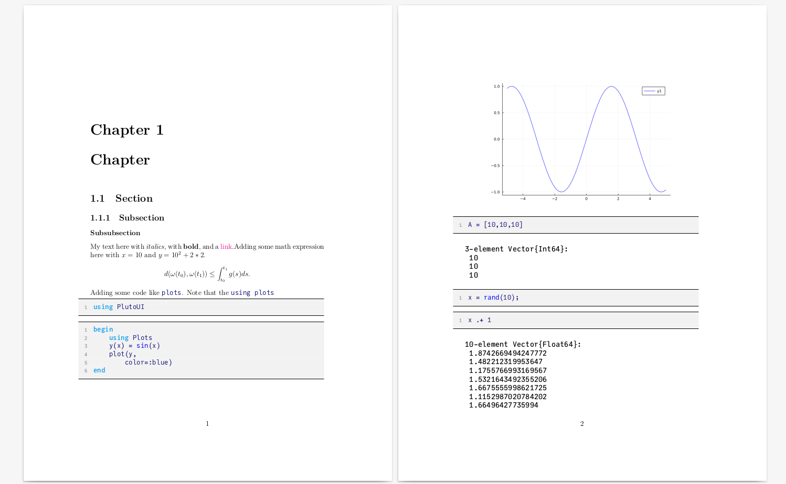

# NotebookToLaTeX.jl <a href='https://github.com/davibarreira/NotebookToLaTeX.jl/blob/master/src/assets/logo.svg'></a>

[![][bag-dev]][bld-dev]
[](https://github.com/davibarreira/NotebookToLaTeX.jl/actions)
[](https://codecov.io/gh/davibarreira/NotebookToLaTeX.jl)

**Important**: The package is still in active development, so things might change/break. Note that the package name is being changed from
*NotebookToLatex.jl* to *NotebookToLaTeX.jl* in order to be more consistent with the naming of other packages in the Julia environment. If you've cloned
this repo before that, you might want to delete and clone again.

*If you try this package and find some bug, or think of a feature you'd like to have implemented, do not hesitate to open an issue*.

## Why this Package?
This package converts your notebook files (Pluto or Jupyter) to beautiful and
simple LaTeX files, that are easy to modify. Thus, making it ideal
to write reports, articles or books from notebooks.



Although it's already possible to convert both Pluto and Jupyter notebooks
to PDFs, or even to LaTeX (via Pandoc), the PDFs are not very customizable
and the LaTeX files are usually very messy.
In contrast, NotebookToLaTeX.jl focuses less in generality, and
more on opinionated defaults.

The package has it's own implementation to parse Markdown to LaTeX,
e.g. it turns `# Example` to `\chapter{Example}`. Thus,
one can dive down into the actual Julia code and customize it
for his own preference. Or, submit an issue requesting
the feature. Hopefully, more and more customization will
be possible from the get go as the package evolves.

Another very important point to note is that NotebookToLaTeX.jl uses
[julia-mono-listing](https://github.com/mossr/julia-mono-listings).
This enables it to produce beautiful Julia code inside the LaTeX pdf.
Note that *it requires using `lualatex` for compilation*.

## Getting Started

This package is very simple to use. There is pretty much just one
function to be used, i.e.
```@docs
notebooktolatex
```

### Basic Use
To convert the notebooks just use `notebooktolatex("mynotebook.jl", template=:book)`.
This will produce a directory `./build_latex/` where the LaTeX files
will be generated. Inside `build_latex/` you will have:
```
build_latex
│   main.tex
│   julia_font.tex
│   julia_listings.tex
│   julia_listings_unicode.tex
│   preface.tex
│
└───figures
│   │   mynotebook_plot1.png
│   └───mynotebook_plot2.png
└───fonts
│   │   JuliaMono_Regular.ttf
│   │   ...
│   
└───frontmatter
│   │   titlepage.tex
│   └───copyright.tex
│
└───notebooks
    └───mynotebook.tex
```
Using `template=:book`, we get the LaTeX book format, thus, we have a `preface.tex`,
a `titlepage.tex` and a `copyright.tex` page. The notebook will be included
as a chapter. To get your final book pdf, just compile the `main.tex` using `lualatex`.

In case you want a different project folder, you can run the command
with an extra argument providing the target directory for the LaTeX files, e.g.:
```julia
`notebooktolatex("mynotebook.jl", "./project/",template=:book)`.
```
This will create a `./project/` folder instead of the `./build_latex`.

Read the [documentation](https://davibarreira.github.io/NotebookToLaTeX.jl/dev) for more information.


[bag-dev]: https://img.shields.io/badge/docs-dev-blue.svg
[bld-dev]: https://davibarreira.github.io/NotebookToLaTeX.jl/dev
